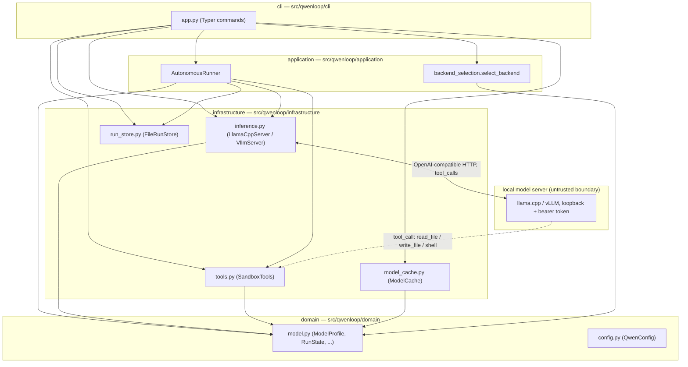

# Architecture overview

Qwenloop is onion-architected: domain code is pure Python with no I/O, and
each outer layer depends inward, never the reverse.

## Trust boundary

Everything the model server returns — text, `tool_calls`, and file/command
output fed back to it — is untrusted (`SECURITY.md`,
[ADR 0002](decisions/0002-tool-security.md)). The only place untrusted model
output can act on the host is through `SandboxTools.execute()`, which is why
that dispatcher's tool names must match exactly what the model-facing schema
in `inference.py` advertises — a mismatch there means a tool call silently
fails instead of running.

## Why there's no generated diagram file

`vibey-gh`'s stricter documentation contract (`[documentation] enabled` in
[`.vibey-gh.toml`](../../.vibey-gh.toml)) expects a generated
`docs/project.mmd`, a marketplace manifest, and a per-agent rules tree. That
contract is deliberately left disabled — adopting it is a separate project,
not a side effect of any one change — so this page is a hand-written
substitute scoped to what a new contributor needs to orient themselves.
