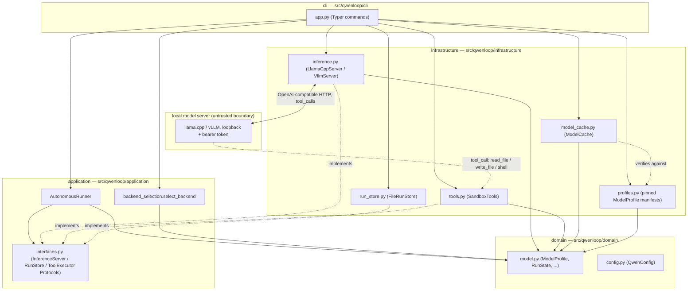

# Architecture overview

Qwenloop is onion-architected: domain code is pure Python with no I/O, and
each outer layer depends inward, never the reverse.

`AutonomousRunner` depends only on the `InferenceServer`/`RunStore`/`ToolExecutor`
Protocols in `interfaces.py` — never on the concrete infrastructure adapters
directly — which is what `uv run lint-imports`'s onion-layering contract
(`pyproject.toml`) enforces. The `-.->|"implements"|` edges above show that
`inference.py`, `tools.py`, and `run_store.py` satisfy those Protocols
structurally, not through inheritance or an explicit import from
infrastructure back to application.

## Trust boundary

Everything the model server returns — text, `tool_calls`, and file/command
output fed back to it — is untrusted (`SECURITY.md`,
[ADR 0002](decisions/0002-tool-security.md)). The only place untrusted model
output can act on the host is through `SandboxTools.execute()`, which is why
that dispatcher's tool names must match exactly what the model-facing schema
in `inference.py` advertises — a mismatch there means a tool call silently
fails instead of running.

## Full project map

This page's diagram is scoped to the onion layers, for a new contributor
orienting themselves in the source tree. For the comprehensive map — every
source module, the CLI command surface, the run lifecycle data flow, the
model trust boundary, and the CI/release/provenance channels in one diagram —
see [`docs/project.mmd`](../project.mmd).

`vibey-gh`'s stricter documentation contract (`[documentation] enabled` in
[`.vibey-gh.toml`](../../.vibey-gh.toml)) would additionally generate a
marketplace manifest and a per-agent rules tree. That part of the contract is
deliberately left disabled — adopting it is a separate project, not a side
effect of any one change.
